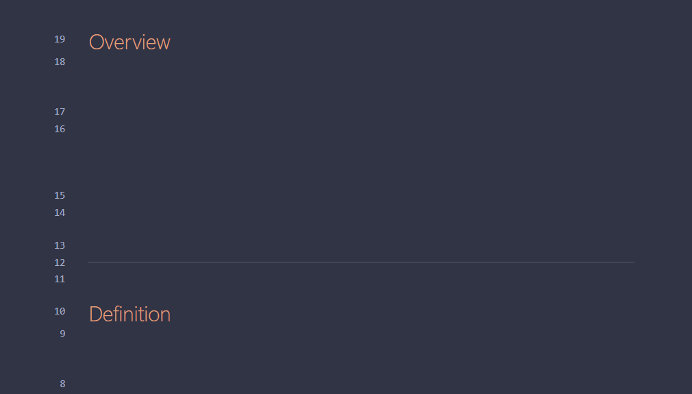
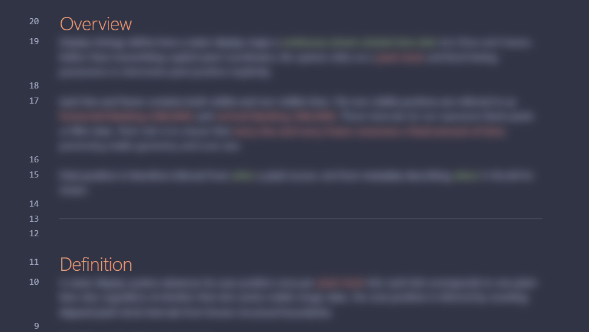
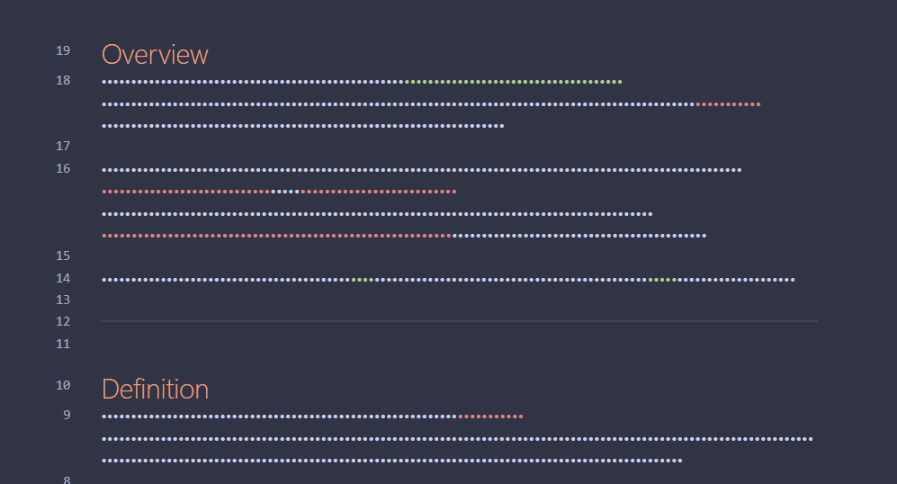
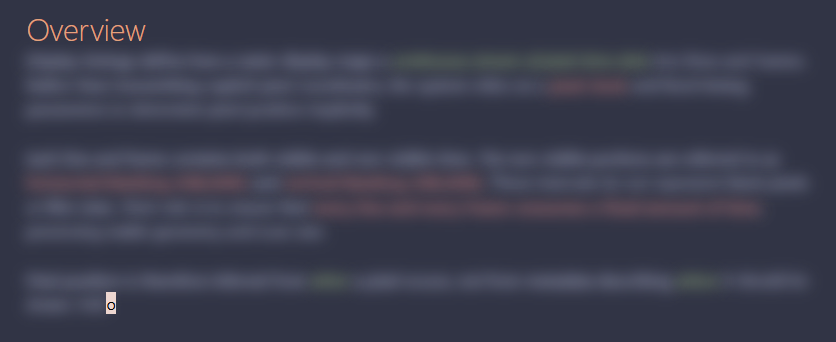
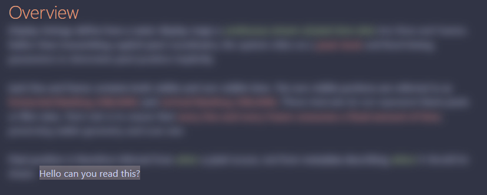

# Text Hider

**Text Hider** is an Obsidian plugin that visually hides your note content while you’re editing. Perfect for writing notes in public spaces without shoulder-surfing.

Text Hider will **not**:

- Change or encrypt your notes
- Modify files on disk

It works entirely at the editor display level. Turn it off at any time and your notes appear exactly as before.

---

## Features

- Toggleable text masking
- Multiple masking styles:
    - **Hide** – completely invisible text (best layout stability)
    - **Blur** – obscures text while preserving structure
    - **Password** – bullet-style masking (may vary by theme)
- Reveal only what you need:
    - Current word **or**
    - Current letter
- Optional exceptions:
    - Keep Markdown headers visible
    - Reveal selected text while selecting

---

## Commands & Hotkeys

Text Hider provides three commands:

- **Toggle privacy mode**
- **Enable privacy mode**
- **Disable privacy mode**

For best use, bind a hotkey to **Toggle privacy mode**:

1. Open **Settings → Hotkeys**
2. Search for **“Text Hider”**
3. Assign your preferred keybinding

All commands are also available via the **Command Palette**.

---

## Settings

### Mask mode

Choose how hidden text is displayed:

- **Hide** – fully invisible (recommended for best layout consistency)
  

- **Blur** – visually obscured but readable up close 

- **Password** – masked with bullet characters (appearance may vary by theme)
  

### Reveal mode

Choose what remains readable at the cursor:

- **Current word**
  

- **Current letter**
  

### Exclude headers

Keeps Markdown headers (`#`, `##`, `###`, etc.) visible while the rest of the note is masked.

### Reveal selected text

When enabled, any text you select becomes visible while selected.

---

## Notes & limitations

- Masking applies only to the **editor view** (Live Preview / Source mode)
- Reading View masking may be added in the future
- Some themes may slightly affect blur or password masking appearance

---

## Development status

Text Hider is under active development.  
Feedback, bug reports, and suggestions are welcome!

---

## License

ISC
